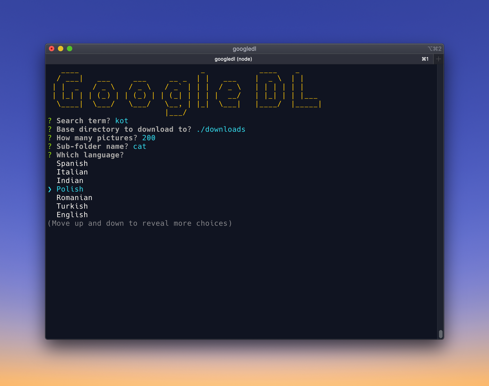

# Google Image Downloader

Command line image downloader from Google based on `images-scraper` (https://github.com/pevers/images-scraper).

## Requirements

This app requires Nodejs version 12 or higher. Also it requires Google Chrome browser installed.

## How to install

`npm install -g @ahmetcetin/image-downloader`

## How to use

Just run `googledl` in terminal, and follow the instructions.

After entering parameters, it will launch Chrome browser and make the search in Google Images, then will download the required number of images to the selected `basefolder/subfolder`. The number of images downloaded might be less than required, as app will download only jpg files.

## How to uninstall

`npm uninstall -g @ahmetcetin/image-downloader`

# Important - Copyright notice!

You can freely use this tool for any purpose but please respect the copyright owners of the images you downloaded using this tool. Downloading image from Internet does not mean that you can use it freely.
